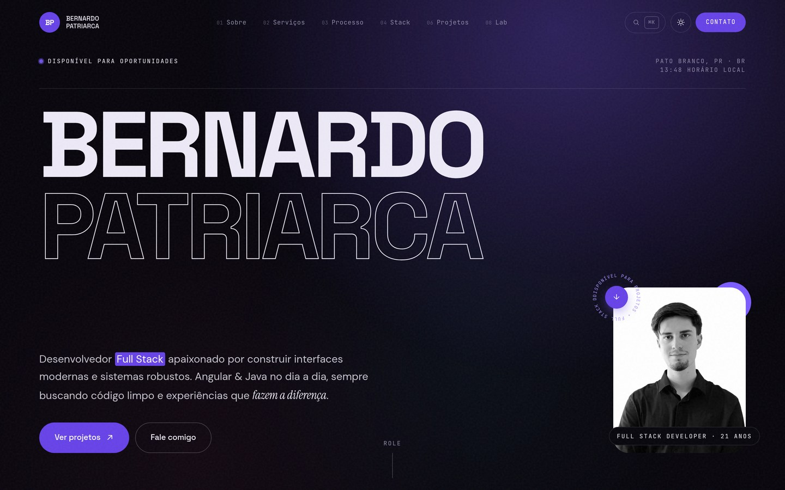
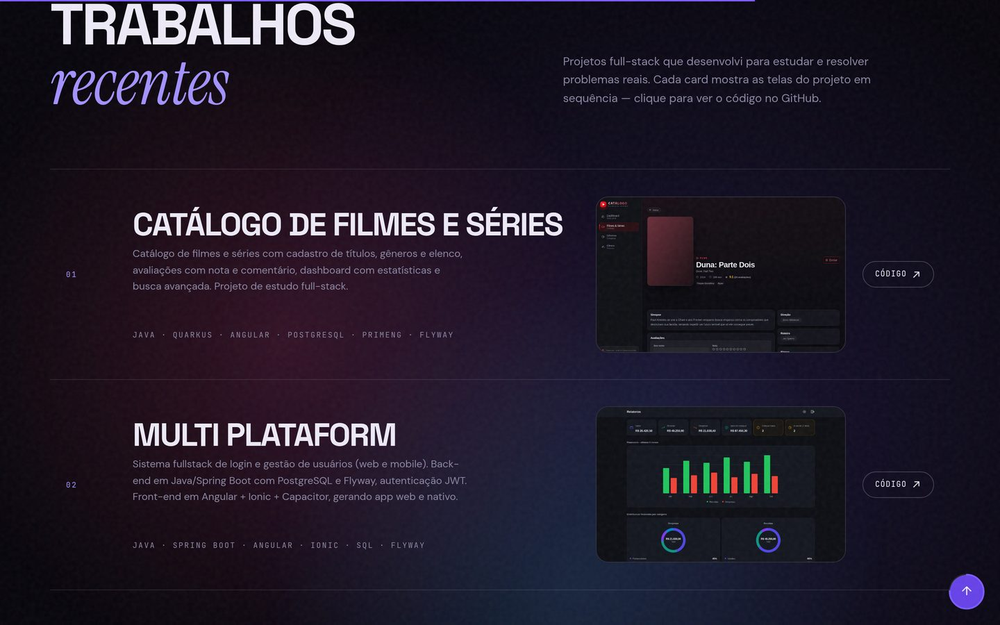
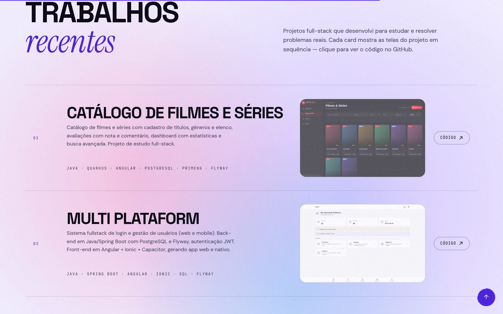
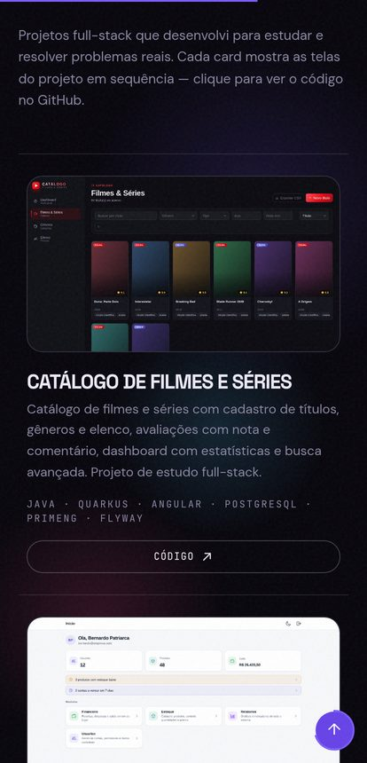

<div align="center">

# Portfólio — Bernardo Patriarca

**Site pessoal de um desenvolvedor full stack.** Sem framework, sem build, sem dependências: só HTML, CSS modular e JavaScript em ES Modules.

[**Ver ao vivo →**](https://bernardopatriarca.netlify.app)


<br>



</div>

---

## O que tem aqui

| | |
| --- | --- |
| **Tema claro e escuro** | Alternância com transição suave, preferência salva no `localStorage`. Toda a paleta sai de custom properties. |
| **Paleta de comandos (⌘K)** | Busca de seções e ações sem tirar a mão do teclado. |
| **Terminal interativo** | Um terminal de verdade no navegador: `about`, `skills`, `projects`, `neofetch`, `matrix`, `goto <seção>`, `open <projeto>` — 25 comandos no total, com histórico e autocomplete no Tab. |
| **GitHub ao vivo** | Repositórios, linguagens e atividade puxados da API pública do GitHub em tempo real — não tem nada chumbado no HTML. |
| **Projetos em slideshow** | Cada projeto alterna suas telas automaticamente, com crossfade. |
| **Movimento com propósito** | Scroll suave, parallax, reveal na entrada, texto embaralhado, cursor customizado e marquee — tudo desligado sob `prefers-reduced-motion`. |
| **Responsivo de verdade** | Layout repensado em cada breakpoint, não só encolhido. |

<div align="center">


<br>
<em>Mesma seção nos dois temas.</em>
<br><br>

</div>

## Rodando local

Precisa de um servidor HTTP — ES Modules não carregam via `file://`.

```bash
git clone https://github.com/BernardoPatriarca/meu-portfolio.git
cd meu-portfolio
python3 -m http.server 4173
```

Abra <http://localhost:4173>. Não tem `npm install`, não tem passo de build: o que está no repositório é exatamente o que vai pro ar.

## Estrutura

```
index.html                 marcação de todas as seções
assets/
├── img/work/              screenshots dos projetos
├── css/
│   ├── main.css           importa todo o resto, nesta ordem
│   ├── base/              tokens, reset, tipografia, layout
│   ├── components/        nav, menu, botão, cursor, terminal, ⌘K, marquee...
│   ├── sections/          hero, sobre, processo, stack, projetos, contato...
│   └── utils/             reveal, responsivo, reduced-motion
└── js/
    ├── main.js            inicializa tudo
    ├── core/              dom, config, loop de rAF, smooth scroll
    ├── components/        preloader, nav, tema, terminal, ⌘K, GitHub...
    └── effects/           parallax, reveal, marquee, slides, scramble...
```

Um arquivo por responsabilidade, tanto no CSS quanto no JS. Nada de `style.css` de 3000 linhas.

## Decisões de arquitetura

**Um loop de animação só.** Todo efeito de scroll passa por `core/raf.js`. Os módulos registram callbacks com `onScroll` (roda quando o scroll muda) ou `onFrame` (roda todo frame), em vez de criar seus próprios `requestAnimationFrame` — um `rAF` por página, não um por efeito.

**Conteúdo em um lugar.** O que muda com frequência — e-mail, redes, projetos, usuário do GitHub — fica em `core/config.js`. Trocar um projeto é editar um objeto, não caçar string no HTML.

**Tema por token.** Tudo vem de custom properties em `base/tokens.css`. `--accent` é para detalhe gráfico; `--accent-surface` é para bloco com texto por cima (mais escuro, garante contraste). Nenhum componente escreve cor literal.

**Movimento é opcional.** `utils/reduced-motion.css` e a flag `reduced` em `core/dom.js` desligam animação, parallax e slideshow para quem pediu menos movimento no sistema.

**Baixo consumo é automático.** Um script inline no `<head>` faz a triagem por núcleos e memória antes do primeiro paint; `core/perf.js` ainda mede o FPS real para pegar GPU fraca ou render por software. Em `[data-perf="low"]` as orbs e o grain param de animar e cursor, magnetic, spotlight e parallax não são iniciados — o layout e as cores continuam iguais.

## Notas

- O CSS usa `@import`, que carrega em cascata. Em produção com muita latência, vale concatenar os arquivos em um só.
- `assets/js/components/terminal/commands.js` concentra os comandos do terminal — basta adicionar uma chave ao objeto para criar um novo.
- As screenshots deste README ficam em `docs/screenshots/`.

## Contato

[Site](https://bernardopatriarca.netlify.app) · [LinkedIn](https://www.linkedin.com/in/bernardopatriarca/) · [GitHub](https://github.com/BernardoPatriarca) · [E-mail](mailto:bernardopatriarca2026@gmail.com)
